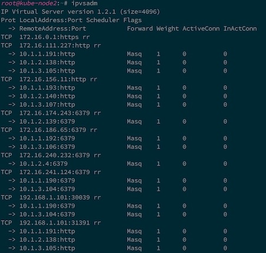
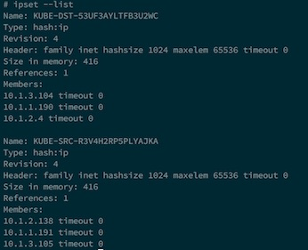

kube-router
==========

Kube-router is a distributed load balancer, firewall and router for Kubernetes. Kube-router can be configured to provide on each cluster node:

- a IPVS/LVS based service proxy on each node for *ClusterIP*, *NodePort* and *LoadBalancer* service types, providing service discovery and load balancing
- an ingress firewall for the pods running on the node as per the defined Kubernetes network policies using iptables and ipset
- a BGP router to advertise and learn the routes to the pod IP's for cross-node pod-to-pod connectivity

## Project status

Project is in alpha stage. We are working towards beta release
[milestone](https://github.com/cloudnativelabs/kube-router/milestone/2) and are
activley incorporating users feedback.

## Getting Started

- [User Guide](./Documentation/README.md#user-guide)
- [Developer Guide](./Documentation/developing.md)
- [Architecture](./Documentation/README.md#architecture)

## Primary Features

*kube-router does it all.*

With all features enabled, kube-router is a lean yet powerful alternative to
several network components used in typical Kubernetes clusters. All this from a
single DaemonSet/Binary. It doesn't get any easier.

### IPVS/LVS based service proxy | `--run-service-proxy`

kube-router uses the Linux kernel's IPVS features to implement its K8s Services
Proxy. This feature has been requested for some time in kube-proxy, but you can
have it right now with kube-router.

Read more about the advantages of IPVS for container load balancing:
- [Kubernetes network services proxy with IPVS/LVS](https://cloudnativelabs.github.io/post/2017-05-10-kube-network-service-proxy/)
- [Kernel Load-Balancing for Docker Containers Using IPVS](https://blog.codeship.com/kernel-load-balancing-for-docker-containers-using-ipvs/)

### Pod Networking | `--run-router`

kube-router handles Pod networking efficiently with direct routing thanks to the
BGP protocol and the GoBGP Go library. It uses the native Kubernetes API to
maintain distributed pod networking state. That means no dependency on a
separate datastore to maintain in your cluster.

kube-router's elegant design also means there is no dependency on another CNI
plugin. The
[official "bridge" plugin](https://github.com/containernetworking/plugins/tree/master/plugins/main/bridge)
provided by the CNI project is all you need -- and chances are you already have
it in your CNI binary directory!

Read more about the advantages and potential of BGP with Kubernetes:
- [Kubernetes pod networking and beyond with BGP](https://cloudnativelabs.github.io/post/2017-05-22-kube-pod-networking)

### Network Policy Controller | `--run-firewall`

Enabling Kubernetes [Network Policies](https://kubernetes.io/docs/concepts/services-networking/network-policies/)
is easy with kube-router -- just add a flag to kube-router. It uses ipsets with
iptables to ensure your firewall rules have as little performance impact on your
cluster as possible.

Kube-router supports the networking.k8s.io/NetworkPolicy API or network policy V1/GA
[semantics](https://github.com/kubernetes/kubernetes/pull/39164#issue-197243974) and also network policy beta semantics.

Read more about kube-router's approach to Kubernetes Network Policies:
- [Enforcing Kubernetes network policies with iptables](https://cloudnativelabs.github.io/post/2017-05-1-kube-network-policies/)

### Advanced BGP Capabilities

If you have other networking devices or SDN systems that talk BGP, kube-router
will fit in perfectly. From a simple full node-to-node mesh to per-node peering
configurations, most routing needs can be attained. The configuration is
Kubernetes native (annotations) just like the rest of kube-router, so use the
tools you already know! Since kube-router uses GoBGP, you have access to a
modern BGP API platform as well right out of the box.

For more details please refer to the [BGP documentation](Documentation/bgp.md).

### Small Footprint

Although it does the work of several of its peers in one binary, kube-router
does it all with a relatively tiny codebase, partly because IPVS is already
there on your Kuberneres nodes waiting to help you do amazing things.
kube-router brings that and GoBGP's modern BGP interface to you in an elegant
package designed from the ground up for Kubernetes.

### High Performance

A primary motivation for kube-router is performance. The combination of BGP for
inter-node Pod networking and IPVS for load balanced proxy Services is a perfect
recipe for high-performance cluster networking at scale. BGP ensures that the
data path is dynamic and efficient, and IPVS provides in-kernel load balancing
that has been thouroughly tested and optimized.

## Contributing

We encourage all kinds of contributions, be they documentation, code, fixing
typos, tests — anything at all. Please read the [contribution guide](./CONTRIBUTING.md).

## Support & Feedback

If you experience any problems please reach us on our gitter
[community forum](https://gitter.im/kube-router/Lobby)
for quick help. Feel free to leave feedback or raise questions at any time by
opening an issue [here](https://github.com/cloudnativelabs/kube-router/issues).

## See it in action

## Theory of Operation

Kube-router can be run as an agent or a Pod (via DaemonSet) on each node and
leverages standard Linux technologies **iptables, ipvs/lvs, ipset, iproute2**

### Service Proxy And Load Balancing

[Kubernetes network services proxy with IPVS/LVS](https://cloudnativelabs.github.io/post/2017-05-10-kube-network-service-proxy/)

Kube-router uses IPVS/LVS technology built in Linux to provide L4 load
balancing. Each **ClusterIP**, **NodePort**, and **LoadBalancer** Kubernetes
Service type is configured as an IPVS virtual service. Each Service Endpoint is
configured as real server to the virtual service.  The standard **ipvsadm** tool
can be used to verify the configuration and monitor the active connections.

Below is example set of Services on Kubernetes:

and the Endpoints for the Services:

and how they got mapped to the IPVS by kube-router:

Kube-router watches the Kubernetes API server to get updates on the
Services/Endpoints and automatically syncs the IPVS configuration to reflect the
desired state of Services. Kube-router uses IPVS masquerading mode and uses
round robin scheduling currently. Source pod IP is preserved so that appropriate
network policies can be applied.

### Pod Ingress Firewall

[Enforcing Kubernetes network policies with iptables](https://cloudnativelabs.github.io/post/2017-05-1-kube-network-policies/)

Kube-router provides an implementation of Kubernetes Network Policies through
the use of iptables, ipset and conntrack.  All the Pods in a Namespace with
'DefaultDeny' ingress isolation policy has ingress blocked. Only traffic that
matches whitelist rules specified in the network policies are permitted to reach
those Pods. The following set of iptables rules and chains in the 'filter' table
are used to achieve the Network Policies semantics.

Each Pod running on the Node which needs ingress blocked by default is matched
in FORWARD and OUTPUT chains of the fliter table and are sent to a pod specific
firewall chain. Below rules are added to match various cases

- Traffic getting switched between the Pods on the same Node through the local
  bridge
- Traffic getting routed between the Pods on different Nodes
- Traffic originating from a Pod and going through the Service proxy and getting
  routed to a Pod on the same Node

Each Pod specific firewall chain has default rule to block the traffic. Rules
are added to jump traffic to the Network Policy specific policy chains. Rules
cover only policies that apply to the destination pod ip. A rule is added to
accept the the established traffic to permit the return traffic.

Each policy chain has rules expressed through source and destination ipsets. Set
of pods matching ingress rule in network policy spec forms a source Pod ip
ipset. set of Pods matching pod selector (for destination Pods) in the Network
Policy forms destination Pod ip ipset.

Finally ipsets are created that are used in forming the rules in the Network
Policy specific chain

Kube-router at runtime watches Kubernetes API server for changes in the
namespace, network policy and pods and dynamically updates iptables and ipset
configuration to reflect desired state of ingress firewall for the the pods.

### Pod Networking

[Kubernetes pod networking and beyond with BGP](https://cloudnativelabs.github.io/post/2017-05-22-kube-pod-networking)

Kube-router is expected to run on each Node. The subnet of the Node is obtained
from the CNI configuration file on the Node or through the Node.PodCidr. Each
kube-router instance on the Node acts as a BGP router and advertises the Pod
CIDR assigned to the Node. Each Node peers with rest of the Nodes in the cluster
forming full mesh. Learned routes about the Pod CIDR from the other Nodes (BGP
peers) are injected into local Node routing table. On the data path, inter Node
Pod-to-Pod communication is done by the routing stack on the Node.

## TODO
- ~~convert Kube-router to docker image and run it as daemonset~~
- heathcheck pods
- explore integration of an ingress controller so Kube-router will be one complete solution for both east-west and north-south traffic
- ~~get pod CIDR from node.PodCidr when kube-controller-manager is run with `--allocate-node-cidrs=true` option~~
- explore the possibility of using IPVS direct routing mode
- Explore the possibilities of making Kube-router on the node a Prometheus endpoint
- ~~session persistence~~

## Acknowledgement

Kube-router build upon following libraries:

- Iptables: https://github.com/coreos/go-iptables
- GoBGP: https://github.com/osrg/gobgp
- Netlink: https://github.com/vishvananda/netlink
- Ipset: https://github.com/janeczku/go-ipset
- IPVS: https://github.com/mqliang/libipvs

